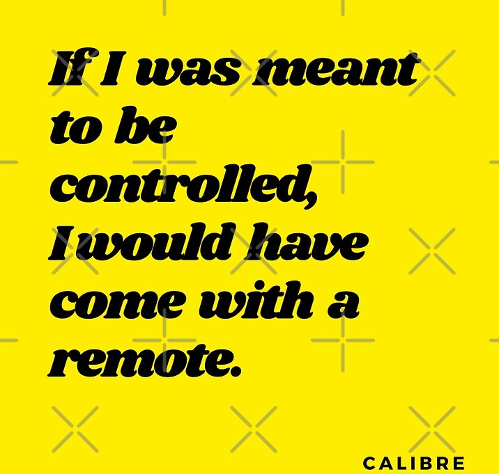

  

# Quotes to live by

> "A true selfless act always sparks another."
  
> "In the end, we are all just stories. Make sure yours is an inspiring one."

> "Actually, the moment you start making some money, you should spend some time trying to figure out yourself. Try out different jobs, experiment, fall in love, travel, do all it takes for you to nourish your mind, body, and soul."

> "Basically, your 20s aren't the time for you to make it. Or, to die trying. It's the decade of indulgence. Have fun, experiment and eventually, find your calling. Get all the chinks in your armor because on the other side of 30, the true test of life shall begin."

> "Our lives are defined by opportunities; even the ones we miss."

> Benjamin Mee:  
> "You know, sometimes all you need is twenty seconds of insane courage. Just literally twenty seconds of just embarrassing bravery. And I promise you, something great will come of it."

> "Me? I haven't made all A's in the art of living. But I give a damn. And I'll take an experienced C over an ignorant A any day."

---

# Some of my writing

Here are a few of my articles, feel free to check them out:

- [**If life is a race**](https://medium.com/@chakraborti.soham/if-life-is-a-race-who-is-winning-f9d3f690f38a)
- [**Mail reading and writing in Node.js**](https://medium.com/@chakraborti.soham/mail-reading-and-writing-in-nodejs-7a71cde5ca24)
- [**Outwork them**](https://medium.com/@chakraborti.soham/outwork-them-8245936c3bdc)

---

For more, follow me on [Medium](https://medium.com/@chakraborti.soham).

---

### Additional Styling Enhancements:
1. **Centered Image**: We’ve made the image centered to give it a more balanced appearance.
2. **Quote Styling**: Added blockquote styling to make the quotes stand out with a larger, italicized font.
3. **Article Links**: Presented the articles as clickable links to make them more prominent.
4. **Medium Link**: A prominent call-to-action to follow on Medium.

If you’re using custom CSS for your Jekyll theme, you could further style these sections by adding CSS classes. For example, you could style the quotes with a larger font size, or the articles list with a different color or spacing.

Let me know if you'd like further customization!
